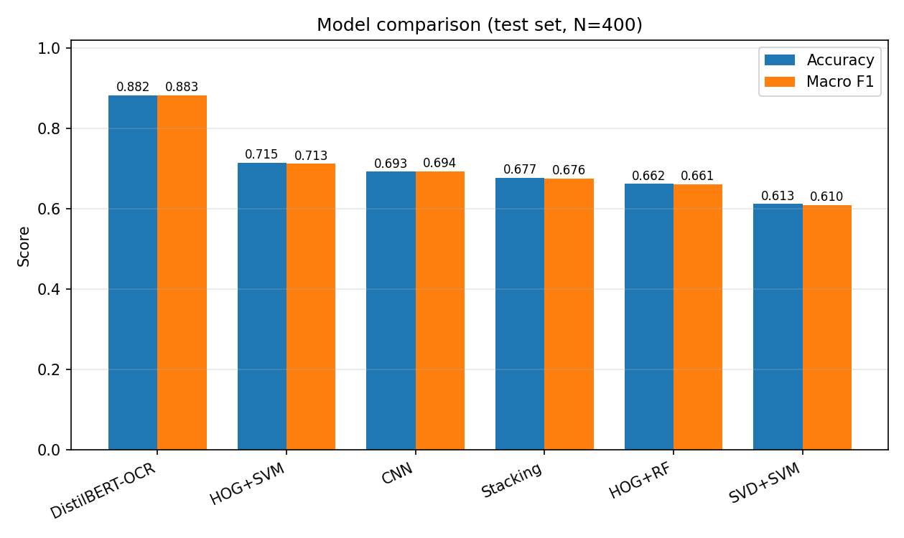

# Model comparison

Held-out test set: **400 samples**, 4 balanced classes: email, invoice, letter, scientific_report.

## Summary

| Model | Accuracy | Macro F1 | F1 (email) | F1 (invoice) | F1 (letter) | F1 (scientific_report) |
|---|---|---|---|---|---|---|
| DistilBERT-OCR | 0.8825 | 0.8829 | 0.900 | 0.867 | 0.864 | 0.901 |
| HOG+SVM | 0.7150 | 0.7127 | 0.928 | 0.653 | 0.639 | 0.632 |
| CNN | 0.6925 | 0.6941 | 0.913 | 0.608 | 0.670 | 0.585 |
| Stacking | 0.6775 | 0.6758 | 0.911 | 0.573 | 0.594 | 0.625 |
| HOG+RF | 0.6625 | 0.6611 | 0.874 | 0.647 | 0.644 | 0.479 |
| SVD+SVM | 0.6125 | 0.6098 | 0.833 | 0.505 | 0.578 | 0.524 |

## Per-model confusion matrices

PNG files produced by the per-model evaluation steps:

- `../../reports/cm_svd+svm.png` · `../../reports/cm_hog+svm.png` · `../../reports/cm_hog+rf.png` · `../../reports/cm_cnn.png` · `../../reports/cm_stacking.png`
- `cm_distilbert.png` (in this folder)

## Discussion template

- **Image-based models** (SVD+SVM, HOG+SVM, HOG+RF, CNN, Stacking) learn directly from pixel / gradient statistics of the 128×128 grayscale scans. They are robust to OCR failures on noisy or low-resolution scans but miss explicit textual cues.
- **DistilBERT-OCR** depends entirely on Tesseract output. Where OCR fails (blurry scans, tables, non-English portions), the transformer has nothing to classify from; where OCR succeeds, it exploits the explicit lexical cues ('invoice', 'amount due', 'Dear Dr.', etc.) that CV models cannot directly perceive.
- The **stacking ensemble** combines complementary errors of the base CV models; adding DistilBERT to the stack would likely improve the ceiling further (left as future work).
- **Practical trade-off for the live demo**: the transformer needs an OCR step at inference time (extra ~0.5–2s per document on CPU) whereas the CV stack runs in <100 ms on the same hardware. This is important to mention in the oral presentation.
